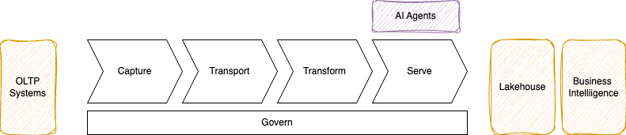
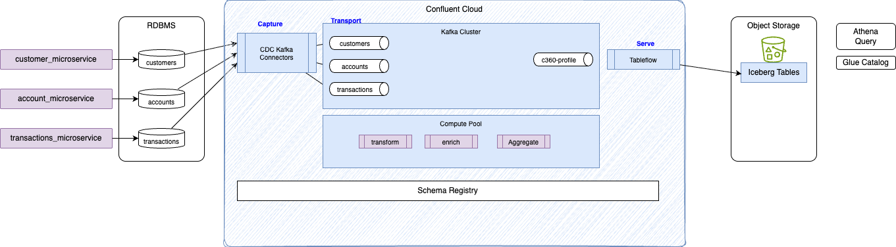
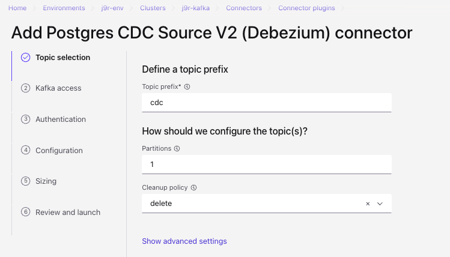
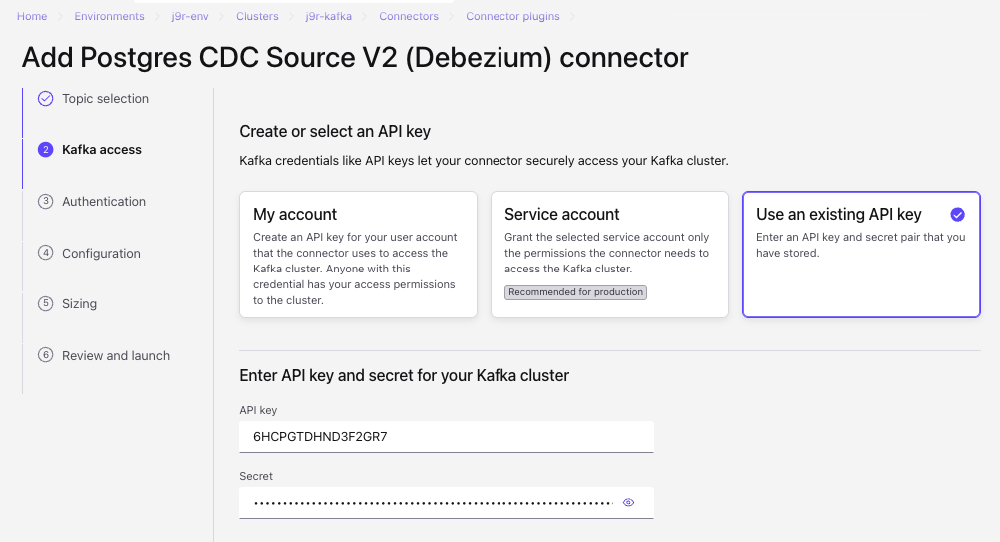
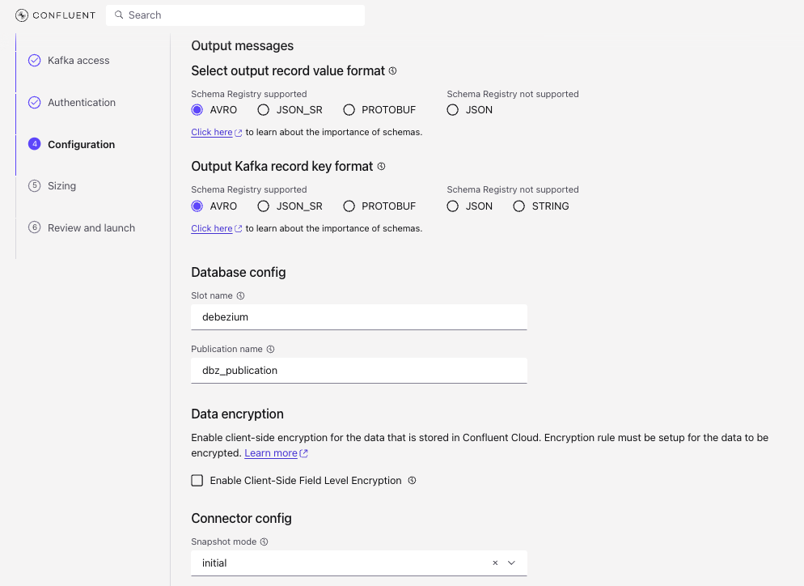

# Streamhouse Customer 360


The purpose of this repo is to implement a Customer 360 streaming data pipeline integrating operational databases (PostgreSQL, DB2) with event streaming, Change Data Capture (CDC), and modern lakehouse analytical sinks.

At the high level Streamhouse reference architecture looks like in the figure below:



When applied to Confluent technology stack will map to the following components:


## Goal of this demonstration

The goal is to demonstrate synchronize a change in business state everywhere it is used. We will mockup transactional application / microservices writing transactions, accounts and customers records to a SQL database. We can use IBM Db2 RDBMS or Postgresql deployed on AWS RDS service. The end to end architecture looks like:



## Actors

We can consider three actors

1. Site Reliability Engineer
1. Data Engineer
1. Application Developer

### SRE

This use case helps to demonstrate the following tasks a SRE needs to conduct to prepare the environment to support the above architecture

### Data Engineer

### Application Developer

## Infrastructure as code

### Pre-requisites

* Get Terraform
* Get aws CLI
* Have CONFLUENT_API_KEY and SECRET
* Get psql client to query Postgresql instance:
    ```
    brew install libpq
    ```
* Login to AWS console, search for VPC to use
    ```sh
    aws sso login --profile your-profile-name
    export AWS_PROFILE="your-profile-name"
    ```

* Run: `terraform init` under IaC folder
* Find you public IP address: [https://checkip.amazonaws.com](https://checkip.amazonaws.com)
* Modify terraform environment variables `terraform.tfvars` with:

```sh
db_allowed_cidr_blocks
my_ip_addr
```

### RDS Postgresql

The database is created in a public subnet of an existing VPC but the security group use the user ip address to define a rule 

The database has three main tables:

* Accounts:
    ```sql
        CREATE TABLE IF NOT EXISTS accounts (
        account_id      UUID            PRIMARY KEY DEFAULT gen_random_uuid(),
        customer_id     UUID            NOT NULL REFERENCES customers(customer_id),
        account_number  VARCHAR(20)     NOT NULL UNIQUE,
        account_type    VARCHAR(30)     NOT NULL,  -- 'CHECKING', 'SAVINGS', 'CREDIT', 'LOAN'
        currency        CHAR(3)         NOT NULL DEFAULT 'USD',
        balance         NUMERIC(18, 2)  NOT NULL DEFAULT 0.00,
        credit_limit    NUMERIC(18, 2),            -- populated for CREDIT / LOAN accounts
        opened_date     DATE            NOT NULL DEFAULT CURRENT_DATE,
        closed_date     DATE,
        status          VARCHAR(20)     NOT NULL DEFAULT 'ACTIVE',
        created_at      TIMESTAMPTZ     NOT NULL DEFAULT NOW(),
        updated_at      TIMESTAMPTZ     NOT NULL DEFAULT NOW()
    )
    ```

* Customers
    ```sql
        CREATE TABLE IF NOT EXISTS customers (
        customer_id     UUID            PRIMARY KEY DEFAULT gen_random_uuid(),
        first_name      VARCHAR(100)    NOT NULL,
        last_name       VARCHAR(100)    NOT NULL,
        email           VARCHAR(255)    NOT NULL UNIQUE,
        phone           VARCHAR(30),
        date_of_birth   DATE,
        gender          VARCHAR(20),
        address_line1   VARCHAR(255),
        address_line2   VARCHAR(255),
        city            VARCHAR(100),
        state           VARCHAR(100),
        postal_code     VARCHAR(20),
        country         VARCHAR(60)     NOT NULL DEFAULT 'US',
        customer_since  DATE            NOT NULL DEFAULT CURRENT_DATE,
        segment         VARCHAR(50),    -- e.g. 'RETAIL', 'SMB', 'ENTERPRISE'
        status          VARCHAR(20)     NOT NULL DEFAULT 'ACTIVE',
        created_at      TIMESTAMPTZ     NOT NULL DEFAULT NOW(),
        updated_at      TIMESTAMPTZ     NOT NULL DEFAULT NOW()
    )
    ```
* Transactions:
    ```sql
        CREATE TABLE IF NOT EXISTS transactions (
        transaction_id   UUID           PRIMARY KEY DEFAULT gen_random_uuid(),
        account_id       UUID           NOT NULL REFERENCES accounts(account_id),
        customer_id      UUID           NOT NULL REFERENCES customers(customer_id),
        transaction_type VARCHAR(30)    NOT NULL,  -- 'DEBIT', 'CREDIT', 'TRANSFER', 'FEE', 'INTEREST'
        amount           NUMERIC(18, 2) NOT NULL,
        currency         CHAR(3)        NOT NULL DEFAULT 'USD',
        description      VARCHAR(500),
        merchant_name    VARCHAR(200),
        merchant_category VARCHAR(100),
        channel          VARCHAR(50),   -- 'ONLINE', 'ATM', 'POS', 'MOBILE', 'BRANCH'
        status           VARCHAR(20)    NOT NULL DEFAULT 'COMPLETED',
        reference_id     VARCHAR(100),  -- external reference / idempotency key
        transacted_at    TIMESTAMPTZ    NOT NULL DEFAULT NOW(),
        posted_at        TIMESTAMPTZ,
        created_at       TIMESTAMPTZ    NOT NULL DEFAULT NOW()
    )
    ```

#### AWS RDS Postgresql

The terraform under IaC/AWS creates the RDS Postgresql 17 instance, with DB subnet group within an existing VPC, security group policies to restrict traffic to PostgreSQL port 5432 within the existing VPC. The Ingress rule allow access to Postgres TCP port 5432 from VPC, client CIDRs, and Confluent Cloud egress.

RDS storage is encrypter with KMS Customer Managed Key and DB secrets. Database credentials are securely saved in AWS Secrets Manager

```sh
terraform plan
terraform apply
terraform output
```

The output gives us the 

```
db_security_group_id = "sg-...."
db_subnet_group_name = "c360-j9r-db-subnet-group"
rds_address = ".....rds.amazonaws.com"
rds_database_name = "c360db"
rds_endpoint = "....rds.amazonaws.com:5432"
rds_port = 5432
secrets_manager_secret_arn = "arn:aws:secretsmanager:....."
vpc_cidr_block = "10......"
vpc_id = "vpc-...."
```

Once the database is up and running, we can get the public SSL certificate to download from the AWS Console.


Then running the following will create the tables and seed test data:

```sh
uv run python seed_data.py --secret-arn "arn:aws:secretsmanager:u...." --ssl-root-cert ~/.ssh/global-bundle.pem
```

#### Use psql to see the RDS

* First get the DB password from the AWS secrets

```sh
DB_PASSWORD=$(aws secretsmanager get-secret-value --secret-id arn:aws:secretsmanager:us-west-2:829250931565:secret:c360-j9r-rds-credentials-9G055x --query SecretString --output text |jq -r .password)
```

* Use this to connect via psql
```sh
PGPASSWORD=$DB_PASSWORD psql -h $RDSHOST -d c360db -U dbadmin sslmode=verify-full sslrootcert=~/.ssh/global-bundle.pem 
```

* In psql session
```sql
--- see all the tables in your current database
\dt

```

#### Some info

* AWS RDS requires a DB Subnet Group. RDS manages its own Elastic Network Interfaces (ENIs). An RDS instance requires a DB Subnet Group defining a pool of subnets across at least two different Availability Zones (AZs) in that VPC (even for Single-AZ instances, so AWS can perform maintenance, failover, or migrations).
* The aws_db_instance resource only accepts db_subnet_group_name, not individual subnet IDs


#### Local tests

Under scripts/local-tests there is a script to start postgresql locally so we can test thre python code. Here are the steps

* Start local postgresql server:
    ```sh
    # Be sure container is started
    container system start

    ./start_pg.sh 
    # it should download postgres container image
    ```

* Create the tables
    ```sh
    ./start_pg.sh --seed
    # OR
    uv run python create_tables.py --host localhost --port "${PG_PORT}" \
      --dbname "${PG_DB}" \
      --username "${PG_USER}" \
      --password "${PG_PASSWORD}" \
      --sslmode disable
    ```

* Verify data are in tables. Start a session in psql:
    ```sh
    container exec -it c360-postgres psql -U dbadmin -d c360db
    ```

    ```sql
    -- Row counts for all three tables
    SELECT 'customers'   AS tbl, COUNT(*) FROM customers
    UNION ALL
    SELECT 'accounts'    AS tbl, COUNT(*) FROM accounts
    UNION ALL
    SELECT 'transactions'AS tbl, COUNT(*) FROM transactions;

    -- Sample a customer with their accounts
    SELECT c.first_name, c.last_name, c.email, c.segment,
        a.account_type, a.balance
    FROM   customers c
    JOIN   accounts a USING (customer_id)
    LIMIT  10;

    -- Recent transactions
    SELECT t.transaction_type, t.amount, t.merchant_name,
        t.merchant_category, t.channel, t.status,
        t.transacted_at
    FROM   transactions t
    ORDER  BY t.transacted_at DESC
    LIMIT  10;

    -- Quit
    \q
    ```

* Wipe any existing container, start fresh, and seed
    ```sh
    ./scripts/local-tests/start_pg.sh --reset --seed
    ```

* Stop and remove the container
    ```sh
    ./scripts/local-tests/start_pg.sh --stop
    ```


#### Enhancement

* RDS should be in private subnet with VPC private link set to Confluent Cloud

### DB2 Community Edition EC2

### Private network


## Create Debezium CDC v2 Kafka Connector

[See product documentation](https://docs.confluent.io/cloud/current/connectors/cc-postgresql-cdc-source-v2-debezium/cc-postgresql-cdc-source-v2-debezium.html)









