# Streamhouse Customer 360

*Updated 9/29/2026*

The purpose of this repo is to implement a Customer 360 streaming data pipeline integrating operational databases (PostgreSQL, DB2,...) with event streaming, Change Data Capture (CDC), and modern lakehouse analytical sinks. 

At the high level Streamhouse reference architecture looks like in the figure below:


When applied to Confluent technology stack will map to the following components:


## Goal of this demonstration

The goal is to demonstrate synchronize a change in business state everywhere it is used. We will mockup transactional application / microservices writing transactions, accounts and customers records to a SQL database. We can use IBM Db2 RDBMS or Postgresql deployed on AWS RDS service. The end to end architecture looks like:


* Microservice applications write to database table. (they will be mcoked up to simple Fast API CRUD on each entities)
* CDC Debezium Kafka Connector, create one topic per table, define schema in schema registry
* A set of Flink queries will prepare the data to build customer 360 analytics metrics, that will be served in a sink topic
* Sink topic is processed by Tableflow to export data as Iceberg table / parquet files into object storage
* External catalogs are in sync with Tableflow catalog
* Other queries are done by Data engineer on data at rest.

## Actors

We can consider three actors

1. Site Reliability Engineer
1. Data Engineer
1. Application Developer

### SRE

This use case helps to demonstrate the following tasks a SRE needs to conduct to prepare the environment to support the above architecture. There are two ways to execute those tasks, via Confluent Cloud Console or via infrastructure as code, using Terraform. The following bullet points are generic task description that should be done using both approaches, (some are for production deployment too). 

1. Create environment, create APIs, roles and kakfa cluster 
1. For Production deployment create private network and network link to Confluent cloud 
1. A Schema Registry for a given environment
1. Create Flink compute pool
1. Create source databases, for example, a RDS service with a Postgresql instance  
1. Create Debezium CDC Source connector for DB tables using terraform
1. Create SQL database and tables into the select database (Postgresql): accounts, customers, transactions. We will use a script for that

*This list will be updated while implementing this demonstration*

### Data Engineer

The following steps are generic and may be supported by different tools:

1. Create dbt project to manage Flink statements using a git repository. One of the approach is to use the `star schema` (see note below)
1. Develop Flink queries using Confluent Cloud Workspace cells
1. Save query to file in git repository, transform for dbt
1. Deploy Flink logic using dbt cli: `dbt run`

*This list will be updated while implementing this demonstration*

[**Star model**](http://jbcodeforce.github.io/flink-studies/cookbook/pm/?h=star+model#the-star-schema) is a multidimensional data model to organize data in a data warehouse. It is used to denormalize business data into dimensions and facts. The `fact` table sits at the center of the start schema. It records the what happened, as quantitative, measurable events. The `Dimension` tables (The "Context") surround the fact table. They provide the "who, what, where, when, and why".

### Application Developer


The following steps are generic and may be supported by different tools:

1. Define contract for data / analytics, and the methodology to engage with Data engineers as part of the microservice design
1. Maintain schema evolution with full transitivity
1. Integrate data in Kafka via Lightning query or snapshot queries.

*This list will be updated while implementing this demonstration*

## SRE's tasks Walking Through

We propose two approches to define the environment and components of this demonstration, one using the Confluent Console or one using Terraform.

### Confluent Console Walk Through

We suppose the user has OrganizatonAdmin role to be able to create environment. 

Pre-requisites:

* Login to the console

#### Create Confluent Cloud Environment

1. From the home page, go to the environment page, and click on the `Add Cloud Environment` button on the top right part of the page.
1. Enter name and select one of the governance package. As the demonstration scope is not about governance, use Essential

    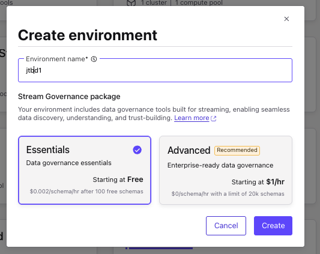

#### Create Confluent Cloud Kafka Cluster

Next step is to create a KafKa Cluster
1. Enter name, and Cluster Type, which for demonstration will be standard.

    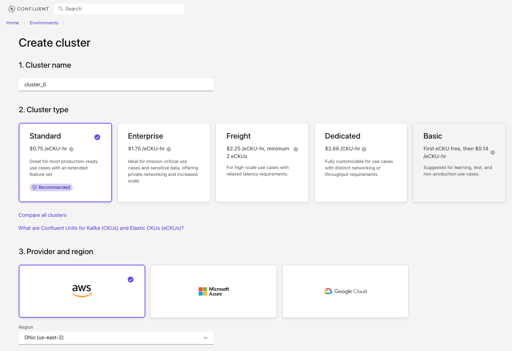
1. Select a Cloud Provider and a region, select a 99.9% SLA
1. Launch the cluster using the right column 'Launch Cluster button`
1. Create API Key and Secrets

*As part of the essential governance, a schema registry is created once the Kafka Cluster is launched.*

#### Create Confluent Cloud Flink Compute Pool

#### AWS Resources

We will not detail how to use the AWS Console to create RDS Postgresql instance and access VPC information. The [terraform section](#aws-resources-rds-postgresql) below describres how to automate the creation of those resources.

It is important to get the following information to be able to create the Kafka Connector for change data capture.

| Resources | |
|-----| ---- |
| Region | us-west-2 |
| RDS host name | e.g. c360-j9r-postgres.c.....us-west-2.rds.amazonaws.com |
| secrets_manager_secret_arn | Resource ref for AWS Secrets Manager |
| Database password  | Coud be created by the admin or retrieve from the secret |
| Public certificates | a .pem file to download |


*To retrieve password from secret, knowing the secret arn do:*
```sh
aws secretsmanager get-secret-value --secret-id arn:aws:secretsmanager:us-west-2:.....:secret:c360-j9r-rds-credentials-9x --query SecretString --output text |jq -r .password
```

It is possible to retrieve the secret ARN from secrets manager:


#### Populate some data into the source database

We propose to use a tool to create the three tables and seed some data. The code is under [./scripts/db/](./scripts/db/)

```bash
cd scripts/db
uv sync
SECRET_ARN=....
# Create tables and seed default data: 50 customers (~100 accounts, ~1 500 transactions)
uv run python seed_data.py --secret-arn "$SECRET_ARN" --region us-west-2 --ssl-root-cert ~/.ssh/global-bundle.pem
```


#### Create Debezium CDC v2 Kafka Connector

Once the database instance is created and has DNS server name and port number and access policies setup, we need to add the Kafka Connector. The figure below illustrates the components created:

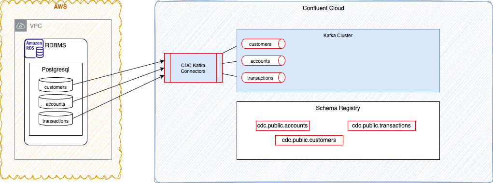

[See confluent Cloud product documentation](https://docs.confluent.io/cloud/current/connectors/cc-postgresql-cdc-source-v2-debezium/cc-postgresql-cdc-source-v2-debezium.html)


1. Select the Kafka Cluster
    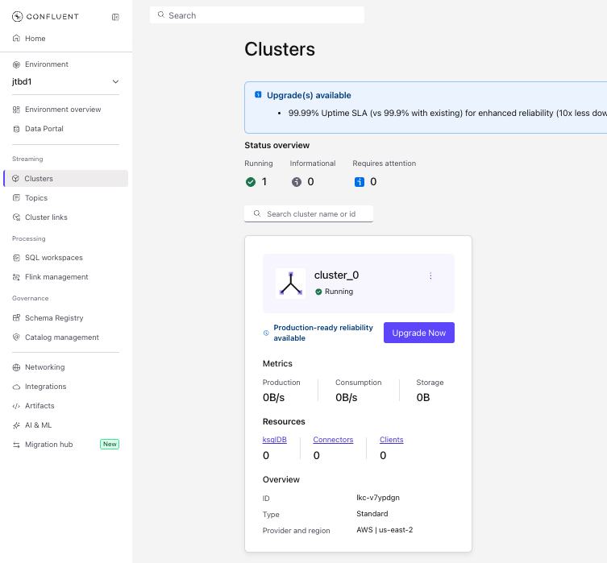

1. Select Connector Tab to land in the connectors home page:
    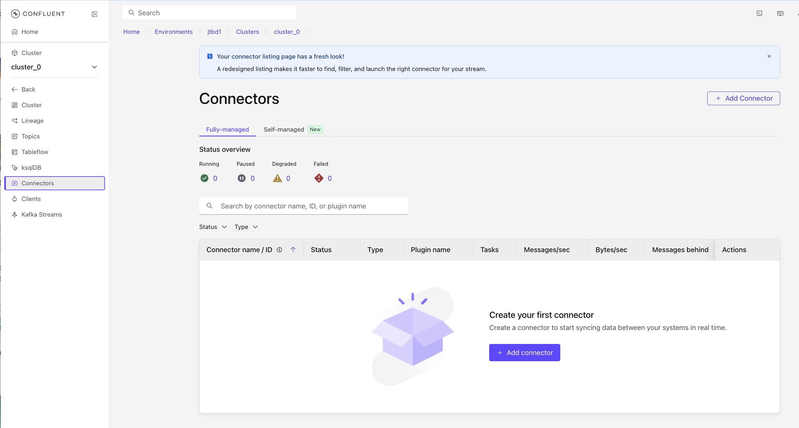

1. Add Connector, and select the Postgres CDC Source V2
    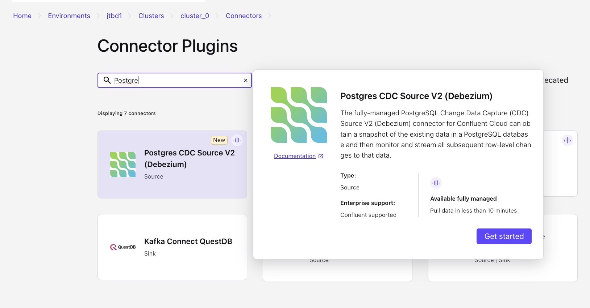

1. Add topic information like the prefix to use to differentiate among other topic. Set the default number of partitions and cleanup policy

    

1. Define how to access the Kafka cluster. Use an existing API Key ...

    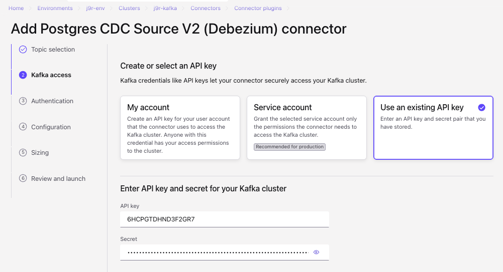

    or create a new one

    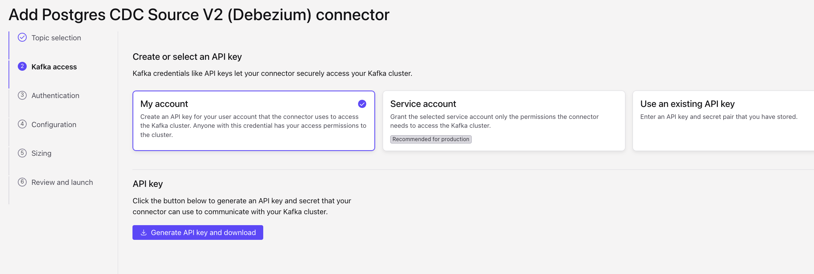


1. Define connection credentials to external database
    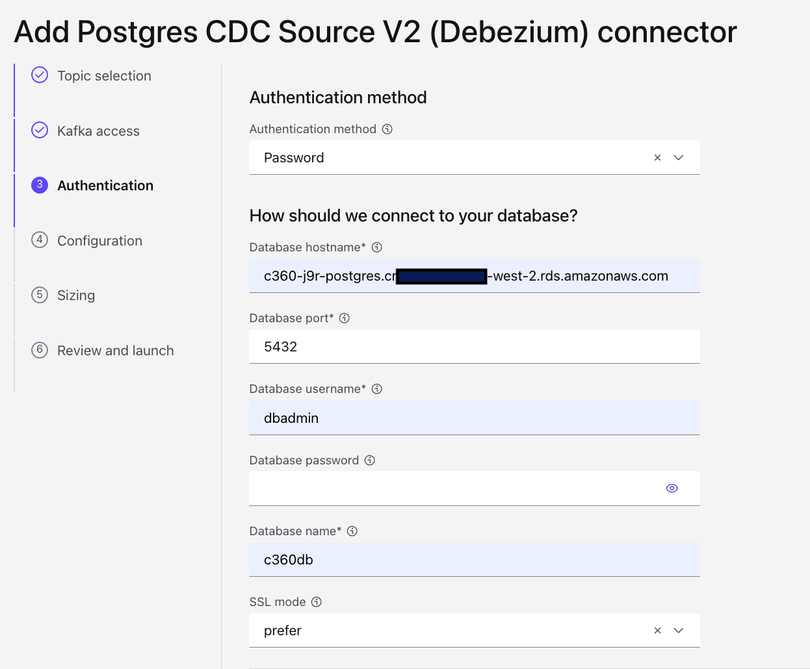


1. Define topic configuration
    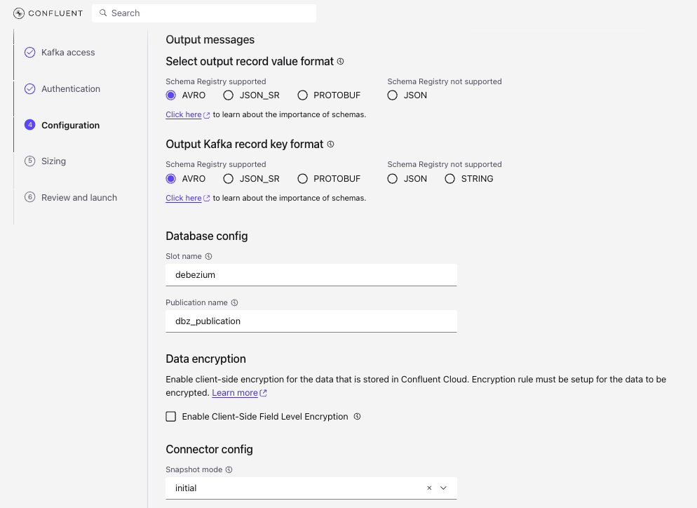

1. Launch the connector
1. Verify created topics
    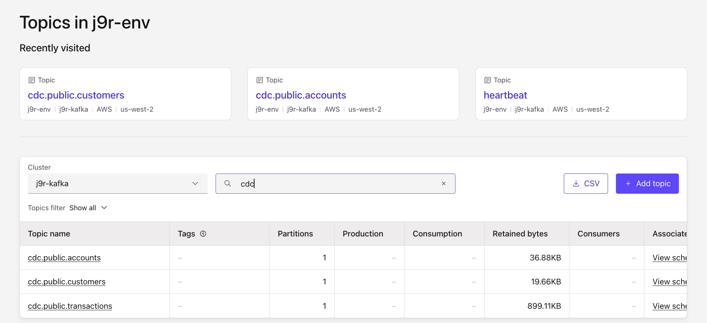

1. Verify Schema registry schemas
    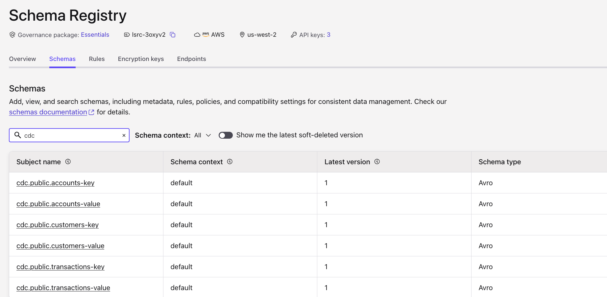


### Terraform

We assume for the current documentation that AWS will be used as cloud provider for the external resources

#### Pre-requisites

* Get Terraform cli
* Get aws CLI
* Have CONFLUENT_API_KEY and SECRET
* Get psql client to query Postgresql instance:
    ```
    brew install libpq
    ```
* Login to AWS console, search for the VPC to use
    ```sh
    aws sso login --profile your-profile-name
    export AWS_PROFILE="your-profile-name"
    ```

* Run: `terraform init` under IaC folder
* Find you the public IP address of your machine: [https://checkip.amazonaws.com](https://checkip.amazonaws.com)
* Modify terraform environment variables `terraform.tfvars` with:
    ```sh
    db_allowed_cidr_blocks
    my_ip_addr
    ```

#### AWS Resources: RDS Postgresql

For coverage of this end to end demonstration we are defining terraform files to create AWS resources. It is not mandatory to do so, if the focus is on data processing using Flink. The goal of preparing external OLTP database is to simulate data processing end-to-end from transaction to change data capture, to kafka topic. 

The database is created in a public subnet of an existing VPC but the security group use the user ip address to define a rule 


The database has three main tables:

* Accounts:
    ```sql
        CREATE TABLE IF NOT EXISTS accounts (
        account_id      UUID            PRIMARY KEY DEFAULT gen_random_uuid(),
        customer_id     UUID            NOT NULL REFERENCES customers(customer_id),
        account_number  VARCHAR(20)     NOT NULL UNIQUE,
        account_type    VARCHAR(30)     NOT NULL,  -- 'CHECKING', 'SAVINGS', 'CREDIT', 'LOAN'
        currency        CHAR(3)         NOT NULL DEFAULT 'USD',
        balance         NUMERIC(18, 2)  NOT NULL DEFAULT 0.00,
        credit_limit    NUMERIC(18, 2),            -- populated for CREDIT / LOAN accounts
        opened_date     DATE            NOT NULL DEFAULT CURRENT_DATE,
        closed_date     DATE,
        status          VARCHAR(20)     NOT NULL DEFAULT 'ACTIVE',
        created_at      TIMESTAMPTZ     NOT NULL DEFAULT NOW(),
        updated_at      TIMESTAMPTZ     NOT NULL DEFAULT NOW()
    )
    ```

* Customers
    ```sql
        CREATE TABLE IF NOT EXISTS customers (
        customer_id     UUID            PRIMARY KEY DEFAULT gen_random_uuid(),
        first_name      VARCHAR(100)    NOT NULL,
        last_name       VARCHAR(100)    NOT NULL,
        email           VARCHAR(255)    NOT NULL UNIQUE,
        phone           VARCHAR(30),
        date_of_birth   TIMESTAMPTZ,
        gender          VARCHAR(20),
        address_line1   VARCHAR(255),
        address_line2   VARCHAR(255),
        city            VARCHAR(100),
        state           VARCHAR(100),
        postal_code     VARCHAR(20),
        country         VARCHAR(60)     NOT NULL DEFAULT 'US',
        customer_since  DATE            NOT NULL DEFAULT CURRENT_DATE,
        segment         VARCHAR(50),    -- e.g. 'RETAIL', 'SMB', 'ENTERPRISE'
        status          VARCHAR(20)     NOT NULL DEFAULT 'ACTIVE',
        created_at      TIMESTAMPTZ     NOT NULL DEFAULT NOW(),
        updated_at      TIMESTAMPTZ     NOT NULL DEFAULT NOW()
    )
    ```
* Transactions:
    ```sql
        CREATE TABLE IF NOT EXISTS transactions (
        transaction_id   UUID           PRIMARY KEY DEFAULT gen_random_uuid(),
        account_id       UUID           NOT NULL REFERENCES accounts(account_id),
        customer_id      UUID           NOT NULL REFERENCES customers(customer_id),
        transaction_type VARCHAR(30)    NOT NULL,  -- 'DEBIT', 'CREDIT', 'TRANSFER', 'FEE', 'INTEREST'
        amount           NUMERIC(18, 2) NOT NULL,
        currency         CHAR(3)        NOT NULL DEFAULT 'USD',
        description      VARCHAR(500),
        merchant_name    VARCHAR(200),
        merchant_category VARCHAR(100),
        channel          VARCHAR(50),   -- 'ONLINE', 'ATM', 'POS', 'MOBILE', 'BRANCH'
        status           VARCHAR(20)    NOT NULL DEFAULT 'COMPLETED',
        reference_id     VARCHAR(100),  -- external reference / idempotency key
        transacted_at    TIMESTAMPTZ    NOT NULL DEFAULT NOW(),
        posted_at        TIMESTAMPTZ,
        created_at       TIMESTAMPTZ    NOT NULL DEFAULT NOW()
    )
    ```

#### AWS RDS Postgresql

The terraform under `IaC/AWS` folder creates the RDS Postgresql 17 instance, with DB subnet group within an existing VPC, security group policies to restrict traffic to PostgreSQL on port 5432 within the existing VPC. The Ingress rules allow access to Postgres TCP port 5432 from VPC, client CIDRs, and Confluent Cloud egress IP addresses.

RDS storage is encrypted with KMS Customer Managed Key and DB secrets. Database credentials are securely saved in AWS Secrets Manager.

```sh
terraform plan
terraform apply
terraform output
```

The output gives us the following:

```
db_security_group_id = "sg-...."
db_subnet_group_name = "c360-j9r-db-subnet-group"
rds_address = ".....rds.amazonaws.com"
rds_database_name = "c360db"
rds_endpoint = "....rds.amazonaws.com:5432"
rds_port = 5432
secrets_manager_secret_arn = "arn:aws:secretsmanager:....."
vpc_cidr_block = "10......"
vpc_id = "vpc-...."
```

Once the database is up and running, we can get the public SSL certificate to download from the AWS Console.

Then running the following will create the tables and the seed test data:

```sh
uv run python seed_data.py --secret-arn "arn:aws:secretsmanager:u...." --ssl-root-cert ~/.ssh/global-bundle.pem
```

#### Use psql to verify data in RDS

* First get the DB password from the AWS secrets

```sh
DB_PASSWORD=$(aws secretsmanager get-secret-value --secret-id arn:aws:secretsmanager:us-west-2:.....:secret:c360-j9r-rds-credentials-9x --query SecretString --output text |jq -r .password)
```

* Use this to connect via psql
```sh
PGPASSWORD=$DB_PASSWORD psql -h $RDSHOST -d c360db -U dbadmin sslmode=verify-full sslrootcert=~/.ssh/global-bundle.pem 
```

* In psql session
```sql
--- see all the tables in your current database
\dt
SELECT * FROM public.accounts
```

#### Some info

* AWS RDS requires a DB Subnet Group. RDS manages its own Elastic Network Interfaces (ENIs). An RDS instance requires a DB Subnet Group defining a pool of subnets across at least two different Availability Zones (AZs) in that VPC (even for Single-AZ instances, so AWS can perform maintenance, failover, or migrations).
* The aws_db_instance resource only accepts db_subnet_group_name, not individual subnet IDs


#### Local tests

Under the `scripts/local-tests` folder, there is a script to start postgresql locally so we can test thre python code. Here are the steps

* Start local postgresql server:
    ```sh
    # Be sure container is started
    container system start

    ./start_pg.sh 
    # it should download postgres container image
    ```

* Create the tables
    ```sh
    ./start_pg.sh --seed
    # OR
    uv run python create_tables.py --host localhost --port "${PG_PORT}" \
      --dbname "${PG_DB}" \
      --username "${PG_USER}" \
      --password "${PG_PASSWORD}" \
      --sslmode disable
    ```

* Verify data are in tables. Start a session in psql:
    ```sh
    container exec -it c360-postgres psql -U dbadmin -d c360db
    ```

    ```sql
    -- Row counts for all three tables
    SELECT 'customers'   AS tbl, COUNT(*) FROM customers
    UNION ALL
    SELECT 'accounts'    AS tbl, COUNT(*) FROM accounts
    UNION ALL
    SELECT 'transactions'AS tbl, COUNT(*) FROM transactions;

    -- Sample a customer with their accounts
    SELECT c.first_name, c.last_name, c.email, c.segment,
        a.account_type, a.balance
    FROM   customers c
    JOIN   accounts a USING (customer_id)
    LIMIT  10;

    -- Recent transactions
    SELECT t.transaction_type, t.amount, t.merchant_name,
        t.merchant_category, t.channel, t.status,
        t.transacted_at
    FROM   transactions t
    ORDER  BY t.transacted_at DESC
    LIMIT  10;

    -- Quit
    \q
    ```

* Wipe any existing container, start fresh, and seed
    ```sh
    ./scripts/local-tests/start_pg.sh --reset --seed
    ```

* Stop and remove the container
    ```sh
    ./scripts/local-tests/start_pg.sh --stop
    ```


#### Enhancement

* RDS should be in private subnet with VPC private link set to Confluent Cloud

## Flink Project Management

We want to implement the following pipelines:


1. First create the pipeline fodler to manage the different Flink SQL statement, using the star model. This can be done manually or use tool from [flink-tools-for-agents](https://github.com/jbcodeforce/flink-tools-for-agents/tree/main/tools/dbt)
    ```sh
    uv run sl-dbt init ~/Code/stream_house_c360_demo
    ```

    Here is the expected structure
    ```sh
    stream_house_c360_demo
    ├── docs
    ├── IaC
    ├── local-tests
    ├── pipelines
    ├── sl_dbt.yaml
    └── tools
    ```

1. Add Data product named c360
    ```sh
    uv run sl-dbt add-data-product ~/Code/stream_house_c360_demo c360
    ```

    Here is the expected structure
    ```sh
    pipelines
        ├── dbt_project.yml
        ├── macros
        ├── models
        │   └── c360
        │       ├── dimensions
        │       ├── facts
        │       └── sources
        ├── pyproject.toml
        ├── seeds
        └── tests
    ```

1. Add one table as output of deduplicating customers raw data

    ```sh
     uv run sl-dbt add-table ~/Code/stream_house_c360_demo src_dedup_customers c360 --table-type  src
    ```

    ```sh
    pipelines
        ├── dbt_project.yml
        ├── macros
        ├── models
        │   └── c360
        │       ├── dimensions
        │       ├── facts
        │       ├── schema.yml
        │       └── sources
        │           ├── src_dedup_customers.sql
        │           └── src_dedup_customers.yml
        ├── pyproject.toml
        ├── seeds
        └── tests
    ```

1. Use the Confluent Cloud Workspace to develop query by using an incremental approach. We will illustrate the approach for beginner.

    1. Assess the source table structure. Run the SQL: `show create table cdc.public.customers`
        

        We can observe the Debezium envelop is already transformed to the sub schema. We can very the schema definitio in the schema repository has a before and after envelop. Go to schema registry page and select `cdc.public.customers-value` 

        

        The reason is the default format for the value and the key are set as:
        ```sh
        value.format' = 'avro-debezium-registry'
        ```

        We can do the same for: `show create table cdc.public.accounts;` and `show create table cdc.public.transactions;`

        We can also discover that by default the changelog mode is set to `retract`. So we could not run snapshot queries but only streaming query.

    1. Look at some data and select only active customer
        ```sql
        SELECT * FROM `j9r-env`.`j9r-kafka`.`cdc.public.customers` where status = 'ACTIVE';
        ```
    1. Because the changelog mode is retract or upsert then the topic, there is no duplicate to the current customers, accounts and transactions, the following query helps to validate that
        ```sql
         with deduped_customer as (
            SELECT 
                    customer_id,
                FROM `cdc.public.customers`
            ),
            numdup as (SELECT
                customer_id,
                count(*) as num_records
            FROM deduped_customer
            group by customer_id)
            select * from numdup where num_records > 1
        ```

        

1. Get the schema from the raw topic to process and automatically generate the source.yaml for dbt
    ```sh
    uv run  sl-dbt get-schema-existing-topic-to-dbt ~/Code/stream_house_c360_demo cdc.public.customers
    ```

1. Continue to create the following flink statements to deduplicate, filter and transform raw CDC topics.

| Source Table(s) | Folder Name | Sink Table |
| ----------------| ------------ |-----------| 
| cdc.public.accounts | sources | src_accounts | 
| cdc.public.customers | sources | src_customers | 
| cdc.public.transactions| sources | src_transactions |
| src_dedup_customers, src_dedup_accounts | dimension |  dim_customers|
| dim_customers, src_transactions | facts | fct_c360_profiles |


1. Undeploy and delete Flink create topics: as dbt does not support undeploying, we need another tool to manage the drop table. The [flink-tools-for-agents](https://github.com/jbcodeforce/flink-tools-for-agents/tree/main/tools/flink) includes tools to define a manifest of metadata and then perform deplooy, undeploy and drop tables. 
    ```sh
    cd flink-tools-for-agents 
    uv run generate-manifest --sql-dir ../stream_house_c360_demo/pipelines/models 
    ```


