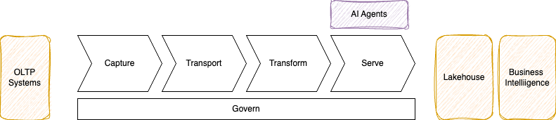
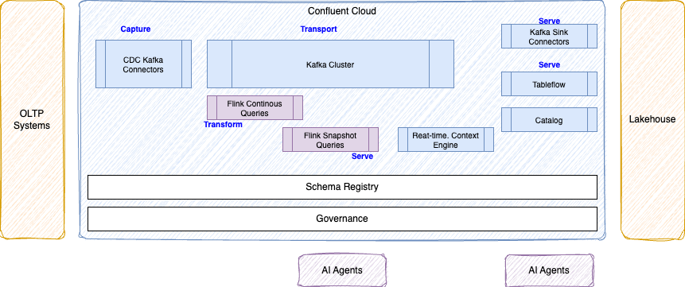
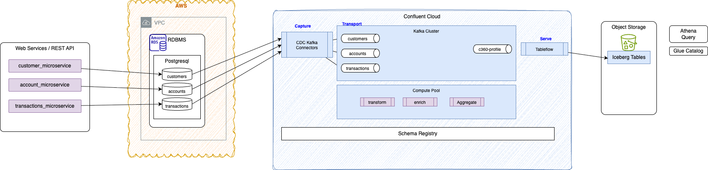
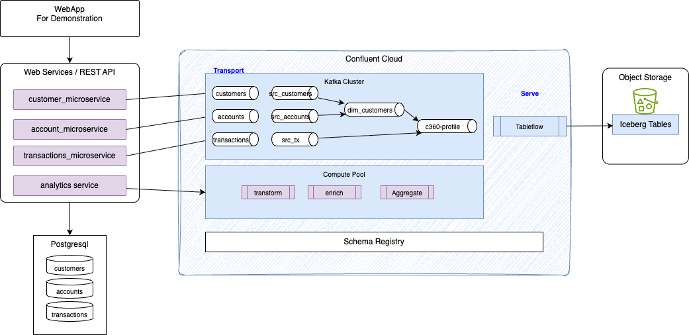
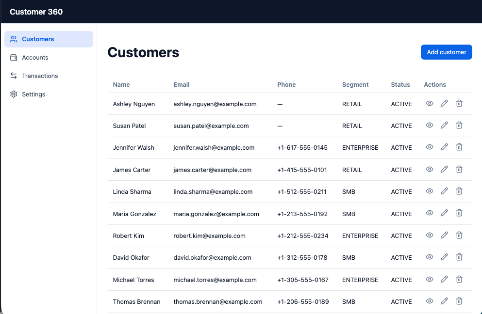
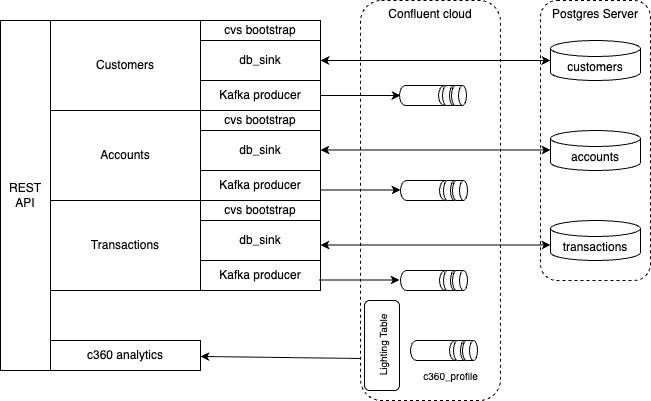
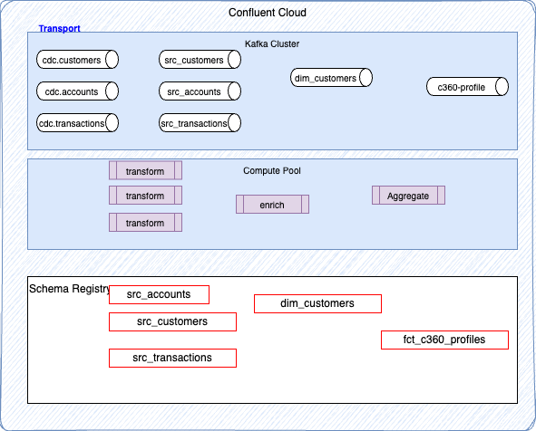
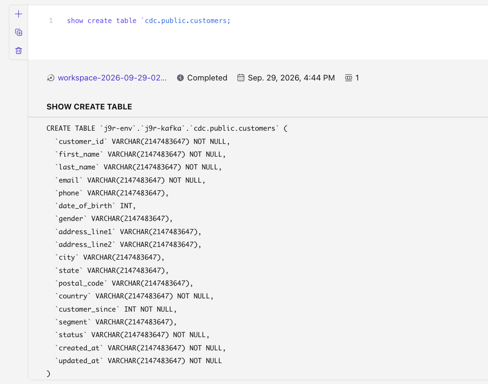
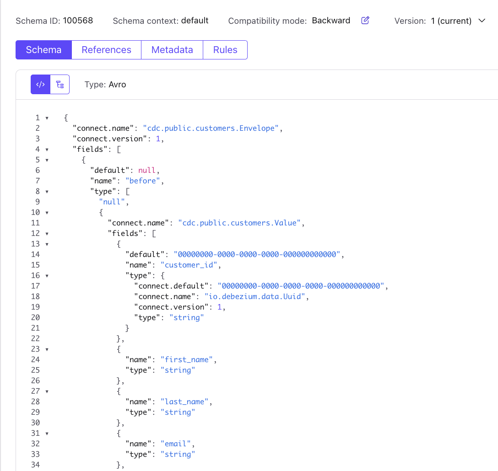
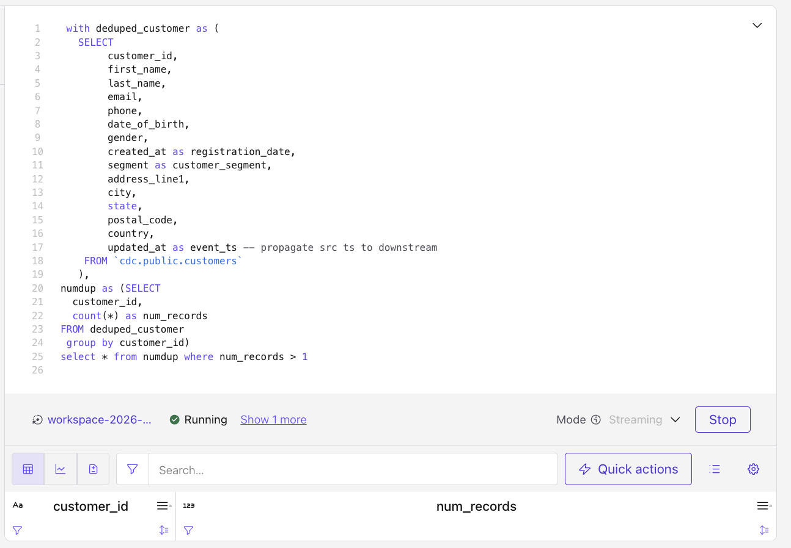

# Streamhouse Customer 360

*Updated 10/04/2026: Add webapp for demos*

The purpose of this repo is to implement a Customer 360 streaming data pipeline integrating operational databases (PostgreSQL, DB2,...) with event streaming, Change Data Capture (CDC), and modern lakehouse analytical sinks. It is a demonstration of Streamhouse.

At the high level, Streamhouse reference architecture looks like in the figure below:



When applied to Confluent technology stack, Streamhouse is supported by the following components:



1. The **capture** is done by Kafka source connectors
1. The **transport** is supported by Kafka Brokers and topics
1. **Transform** is done by Confluent Cloud for Flink
1. **Serve** is supported by Flink with snapshot queries, by Kafka Sink connectors and Tableflow to write Iceberg Tables to object storage. Real-time context engine is also a serving layer for AI Agents.

### Actors

The Streamhouse architecture offers services for three actors

1. Site Reliability Engineer
1. Data Engineer
1. Application Developer

#### SRE

This use case helps to demonstrate the following tasks a SRE needs to conduct to prepare the environment to support the above architecture. There are two ways to execute those tasks, via Confluent Cloud Console or via infrastructure as code, using Terraform. The following bullet points are generic task description that should be done using both approaches, (some are for production deployment too). 

1. Create environment, create APIs, roles and kakfa cluster 
1. For Production deployment create private network and network link to Confluent cloud 
1. A Schema Registry for a given environment
1. Create Flink compute pool
1. Create source databases, for example, a RDS service with a Postgresql instance  
1. Create Debezium CDC Source connector for DB tables using terraform
1. Create SQL database and tables into the select database (Postgresql): accounts, customers, transactions. We will use a script for that

*This list will be updated while implementing this demonstration*

#### Data Engineer

The following steps are generic and may be supported by different tools:

1. Create dbt project to manage Flink statements using a git repository. One of the approach is to use the `star schema` (see note below)
1. Develop Flink queries using Confluent Cloud Workspace cells
1. Save query to file in git repository, transform for dbt
1. Deploy Flink logic using dbt cli: `dbt run`

*This list will be updated while implementing this demonstration*

[**Star model**](http://jbcodeforce.github.io/flink-studies/cookbook/pm/?h=star+model#the-star-schema) is a multidimensional data model to organize data in a data warehouse. It is used to denormalize business data into dimensions and facts. The `fact` table sits at the center of the start schema. It records the what happened, as quantitative, measurable events. The `Dimension` tables (The "Context") surround the fact table. They provide the "who, what, where, when, and why".

#### Application Developer


The following steps are generic and may be supported by different tools:

1. Define contract for data / analytics, and the methodology to engage with Data engineers as part of the microservice design
1. Maintain schema evolution with full transitivity
1. Integrate data in Kafka via Lightning query or snapshot queries.

*This list will be updated while implementing this demonstration*

--- 

## Goal of this demonstration

**The goal is to demonstrate how to synchronize a change in business state everywhere it is used.**

We will mockup transactional application / microservices writing transactions, accounts and customers records to a SQL database. We can use IBM Db2 RDBMS or Postgresql. The end-to-end, more complex architecture, looks like in the following figure:



* Microservice applications write to database tables.
* PostgreSQL database server on AWS RDS
* CDC Debezium Kafka Connector, create one topic per table, define schema in schema registry
* A set of Flink queries will prepare the data to build customer 360 analytics metrics, that will be served in a sink topic
* Sink topic is processed by Tableflow to export data as Iceberg table / parquet files into object storage
* External catalogs are in sync with Tableflow catalog
* Other queries are done by Data engineer on data at rest.
* Web Application for demonstration (run locally as of now)

There is a simpler architecture to run database and code locally with Confluent Cloud for Kafka, Flink, Tableflow and Streamhouse components.



The differences with the more complex demonstration, are:
* the postgresq server runs locally via container (on Mac - docker compose on Windows. (not yet supported)).
* The application writes directly to cdc.public.* topics as Debezium will do
* WebApp runs locally


The WebApp adds simple navigation, to create, update, delete customers and accounts. Transactions are creation only.



### Backend Architecture

The Web App and backend to support running the demonstration has the following components:



* [See implementation details for developers willing to update this demonstration](./docs/web_app_design.md)

### Demonstration Script

*  Deploy Confluent Cloud components: This step is to create Environment, Kafka cluster, schema registry, service accounts, api keys and secrets, and compute pools. We propose two approches to define the environment and components of this demonstration, one using the Confluent Console or one using Terraform:
    * [using Terraform](./docs/sre_ccloud_tf.md).
    * [or using the Confluent cloud console](./docs/sre_ccloud.md)
* [See dedicated note](./docs/demo_script.md) to run the application with local components.
* [See AWS components deployments](./docs/sre_aws.md)


---

UNDER REWORK

#### Populate some data into the source database

We propose to use a tool to create the three tables and seed some data. The code is under [./scripts/db/](./scripts/db/)

```bash
cd scripts/db
uv sync
SECRET_ARN=....
# Create tables and seed default data: 50 customers (~100 accounts, ~1 500 transactions)
uv run python seed_data.py --secret-arn "$SECRET_ARN" --region us-west-2 --ssl-root-cert ~/.ssh/global-bundle.pem
```


## Flink Project Management

We want to implement the following pipelines:




1. First create the pipeline fodler to manage the different Flink SQL statement, using the star model. This can be done manually or use tool from [flink-tools-for-agents](https://github.com/jbcodeforce/flink-tools-for-agents/tree/main/tools/dbt)
    ```sh
    uv run sl-dbt init ~/Code/stream_house_c360_demo
    ```

    Here is the expected structure
    ```sh
    stream_house_c360_demo
    ├── docs
    ├── IaC
    ├── local-tests
    ├── pipelines
    ├── sl_dbt.yaml
    └── tools
    ```

1. Add Data product named c360
    ```sh
    uv run sl-dbt add-data-product ~/Code/stream_house_c360_demo c360
    ```

    Here is the expected structure
    ```sh
    pipelines
        ├── dbt_project.yml
        ├── macros
        ├── models
        │   └── c360
        │       ├── dimensions
        │       ├── facts
        │       └── sources
        ├── pyproject.toml
        ├── seeds
        └── tests
    ```

1. Add one table as output of deduplicating customers raw data

    ```sh
     uv run sl-dbt add-table ~/Code/stream_house_c360_demo src_dedup_customers c360 --table-type  src
    ```

    ```sh
    pipelines
        ├── dbt_project.yml
        ├── macros
        ├── models
        │   └── c360
        │       ├── dimensions
        │       ├── facts
        │       ├── schema.yml
        │       └── sources
        │           ├── src_dedup_customers.sql
        │           └── src_dedup_customers.yml
        ├── pyproject.toml
        ├── seeds
        └── tests
    ```

1. Use the Confluent Cloud Workspace to develop query by using an incremental approach. We will illustrate the approach for beginner.

    1. Assess the source table structure. Run the SQL: `show create table cdc.public.customers`
        

        We can observe the Debezium envelop is already transformed to the sub schema. We can very the schema definitio in the schema repository has a before and after envelop. Go to schema registry page and select `cdc.public.customers-value` 

        

        The reason is the default format for the value and the key are set as:
        ```sh
        value.format' = 'avro-debezium-registry'
        ```

        We can do the same for: `show create table cdc.public.accounts;` and `show create table cdc.public.transactions;`

        We can also discover that by default the changelog mode is set to `retract`. So we could not run snapshot queries but only streaming query.

    1. Look at some data and select only active customer
        ```sql
        SELECT * FROM `j9r-env`.`j9r-kafka`.`cdc.public.customers` where status = 'ACTIVE';
        ```
    1. Because the changelog mode is retract or upsert then the topic, there is no duplicate to the current customers, accounts and transactions, the following query helps to validate that
        ```sql
         with deduped_customer as (
            SELECT 
                    customer_id,
                FROM `cdc.public.customers`
            ),
            numdup as (SELECT
                customer_id,
                count(*) as num_records
            FROM deduped_customer
            group by customer_id)
            select * from numdup where num_records > 1
        ```

        

1. Get the schema from the raw topic to process and automatically generate the source.yaml for dbt
    ```sh
    uv run  sl-dbt get-schema-existing-topic-to-dbt ~/Code/stream_house_c360_demo cdc.public.customers
    ```

1. Continue to create the following flink statements to deduplicate, filter and transform raw CDC topics.

| Source Table(s) | Folder Name | Sink Table |
| ----------------| ------------ |-----------| 
| cdc.public.accounts | sources | src_accounts | 
| cdc.public.customers | sources | src_customers | 
| cdc.public.transactions| sources | src_transactions |
| src_dedup_customers, src_dedup_accounts | dimension |  dim_customers|
| dim_customers, src_transactions | facts | fct_c360_profiles |


1. Undeploy and delete Flink create topics: as dbt does not support undeploying, we need another tool to manage the drop table. The [flink-tools-for-agents](https://github.com/jbcodeforce/flink-tools-for-agents/tree/main/tools/flink) includes tools to define a manifest of metadata and then perform deplooy, undeploy and drop tables. 
    ```sh
    cd flink-tools-for-agents 
    uv run generate-manifest --sql-dir ../stream_house_c360_demo/pipelines/models 
    ```


