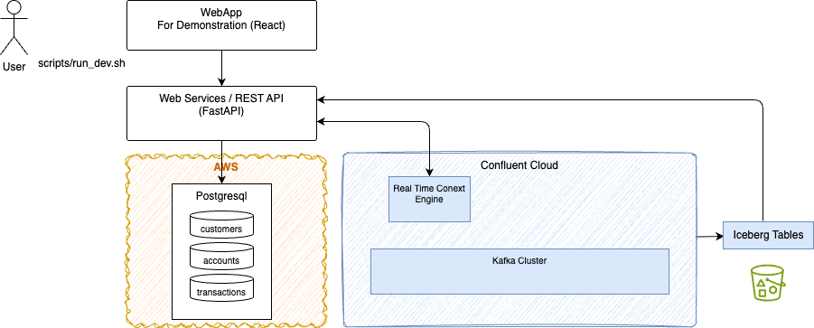
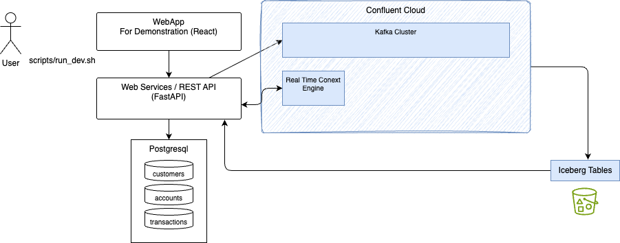

# Demonstration Script

Two approaches: 

1. local database, writing directly to Kafka topics defined within Confluent Cloud Kafka Cluster
2. Run Database on AWS, with Kafka Connector defined to get data from the database to Kafka topics. This approach has cost for the services on AWS.

The web application is able to write to remote database or work with local database and remote Kafka.

## Run with a remote database server

The architecture of the demonstration at the high-level looks like:



* Once the Confluent Cloud and AWS resources are created by Terraform, the user starts the local web application that connect to remote database server.

* Set environment variables to access Confluent Cloud resources, like Kafka, schema KEY/secrets and bootstrap address:
    ```sh
    source ./scripts/set_env_from_tf.sh
    ```

* Start the local webapp with remote database
    ```sh
    ./scripts/run_dev.sh --db rds
    ```

* [Follow with demonstration script](#demonstration-script)

## Run with Local Database Get started locally



* Set environment variables to access Confluent Cloud resources, like Kafka, schema KEY/secrets and bootstrap address:
    ```sh
    source ./scripts/set_env_from_tf.sh
    ```

* Start the local webapp
    ```sh
    ./scripts/run_dev.sh 
    ```


### Customers Management

The customers page presents a list of customers in the real database:


It is possible to add a new customer, or update an existing one.

### Accounts Management

The accounts page presents a list of account per customer in the real database:


### Transaction Management

The transactions page presents a list of current transactions in the real database:


### Verify data are in tables. 

* Start a session in psql:
    ```sh
    container exec -it c360-postgres psql -U dbadmin -d c360db
    ```

    ```sql
    -- Row counts for all three tables
    SELECT 'customers'   AS tbl, COUNT(*) FROM customers
    UNION ALL
    SELECT 'accounts'    AS tbl, COUNT(*) FROM accounts
    UNION ALL
    SELECT 'transactions'AS tbl, COUNT(*) FROM transactions;

    -- Sample a customer with their accounts
    SELECT c.first_name, c.last_name, c.email, c.segment,
        a.account_type, a.balance
    FROM   customers c
    JOIN   accounts a USING (customer_id)
    LIMIT  10;

    -- Recent transactions
    SELECT t.transaction_type, t.amount, t.merchant_name,
        t.merchant_category, t.channel, t.status,
        t.transacted_at
    FROM   transactions t
    ORDER  BY t.transacted_at DESC
    LIMIT  10;

    -- Quit
    \q
    ```
