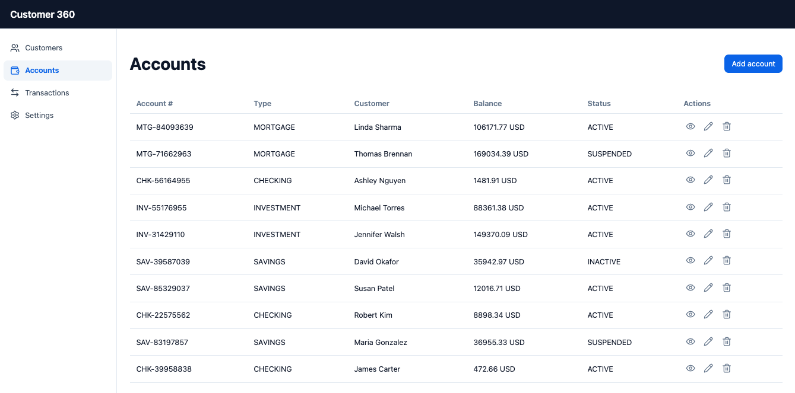
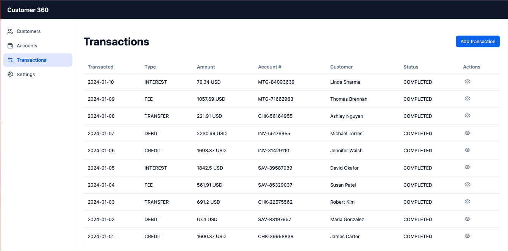

# Demonstration Script

Two approaches: 
1. local database, writing directly to Kafka topics defined within Confluent Cloud Kafka Cluster
2. Run Database on AWS, with Kafka Connector defined to get data from the database to Kafka topics. This approach has cost for the services on AWS.

## Get started locally

The architecture is:


* Set .env under the apps/backend, by copying from `.env.example`
    ```sh
    cd app/backend
    cp .env.example .env
    ```

* Start the database server
    ```sh
    cd apps/backend
    ./start_local_pg_server.sh
    ```

* Start the backend
    ```sh
    cd app/backend
    uv run uvicorn main:app --reload 
    ```

    Access to REST API: [http://localhost:8000/docs](http://localhost:8000/docs)


* Start the user interface
    ```sh
    cd apps/frontend
    npm run dev
    ```

    Access to the webapp: [http://localhost:5173/](http://localhost:5173/)

### Customers Management


### Accounts Management




### Transaction Management




### Verify data are in tables. 

* Start a session in psql:
    ```sh
    container exec -it c360-postgres psql -U dbadmin -d c360db
    ```

    ```sql
    -- Row counts for all three tables
    SELECT 'customers'   AS tbl, COUNT(*) FROM customers
    UNION ALL
    SELECT 'accounts'    AS tbl, COUNT(*) FROM accounts
    UNION ALL
    SELECT 'transactions'AS tbl, COUNT(*) FROM transactions;

    -- Sample a customer with their accounts
    SELECT c.first_name, c.last_name, c.email, c.segment,
        a.account_type, a.balance
    FROM   customers c
    JOIN   accounts a USING (customer_id)
    LIMIT  10;

    -- Recent transactions
    SELECT t.transaction_type, t.amount, t.merchant_name,
        t.merchant_category, t.channel, t.status,
        t.transacted_at
    FROM   transactions t
    ORDER  BY t.transacted_at DESC
    LIMIT  10;

    -- Quit
    \q
    ```
