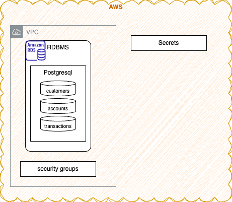
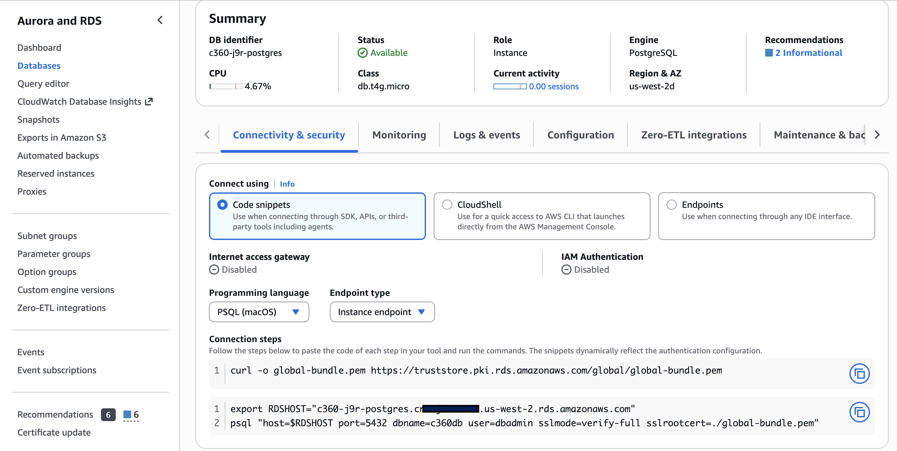
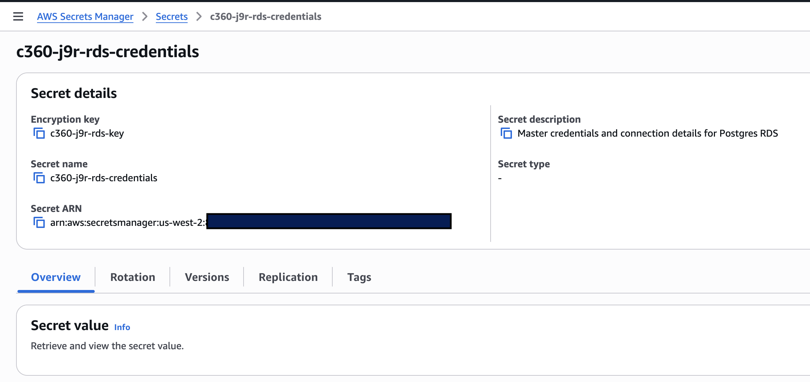

# AWS Resources

This section of the documentation is to create AWS resources for the end-to-end Streamhouse demonstration with source database, S3 buckets and Catalog.

Terraform is organized under the [`IaC/`](IaC/) directory as **three independent root modules** (separate local state), each file-per-concern. This split lets the core Confluent Cloud stack run locally with **no AWS credentials**; AWS and the managed connector are opt-in cost paths.

- [`IaC/AWS/`](IaC/AWS/) — **AWS stack**: PostgreSQL RDS 17 (CDC-ready), VPC/subnet lookups, security group (allowlists Confluent egress IPs), KMS, and the Secrets Manager secret consumed by `IaC/connector/`. Files: `provider.tf`, `variables.tf`, `data.tf`, `aws.tf`, `outputs.tf`.

- [`IaC/connector/`](IaC/connector/) — managed Debezium Postgres CDC connector on Confluent cloud: reads the core stack's outputs from `../ccloud/terraform.tfstate` via `terraform_remote_state`, and the RDS credentials from AWS Secrets Manager. Run with [`scripts/tf_connector.sh`](scripts/tf_connector.sh) (needs AWS creds). Optional — in local mode the backend app writes Debezium-shaped events directly to `cdc.public.*` topics instead.

**Apply order:** `IaC/ccloud` → `IaC/AWS` →  `IaC/connector.


The resources created are illustrated in following figure:




### Pre-requisites

* Get [Terraform cli](https://developer.hashicorp.com/terraform/tutorials/aws-get-started/install-cli)
* Get [aws CLI](https://docs.aws.amazon.com/cli/latest/userguide/getting-started-install.html)
* Get psql client to query Postgresql instance:
    ```
    brew install libpq
    ```

* Login to AWS console using one of your profile aved in `~/.aws/credentials` 
    ```sh
    aws sso login --profile your-profile-name
    export AWS_PROFILE="your-profile-name"
    ```
    
* Find you the public IP address of your machine: [https://checkip.amazonaws.com](https://checkip.amazonaws.com)
* Modify terraform environment variables `terraform.tfvars` with:
    ```sh
    db_allowed_cidr_blocks
    my_ip_addr
    ```


#### AWS Resources: RDS Postgresql

For coverage of this end to end demonstration we are defining terraform files to create AWS resources. It is not mandatory to do so, if the focus is on data processing using Flink. The goal of preparing external OLTP database is to simulate data processing end-to-end from transaction to change data capture, to kafka topic. 

The database is created in a public subnet of an existing VPC but the security group use the user ip address to define a rule 


The database has three main tables:

* Accounts:
    ```sql
        CREATE TABLE IF NOT EXISTS accounts (
        account_id      UUID            PRIMARY KEY DEFAULT gen_random_uuid(),
        customer_id     UUID            NOT NULL REFERENCES customers(customer_id),
        account_number  VARCHAR(20)     NOT NULL UNIQUE,
        account_type    VARCHAR(30)     NOT NULL,  -- 'CHECKING', 'SAVINGS', 'CREDIT', 'LOAN'
        currency        CHAR(3)         NOT NULL DEFAULT 'USD',
        balance         NUMERIC(18, 2)  NOT NULL DEFAULT 0.00,
        credit_limit    NUMERIC(18, 2),            -- populated for CREDIT / LOAN accounts
        opened_date     DATE            NOT NULL DEFAULT CURRENT_DATE,
        closed_date     DATE,
        status          VARCHAR(20)     NOT NULL DEFAULT 'ACTIVE',
        created_at      TIMESTAMPTZ     NOT NULL DEFAULT NOW(),
        updated_at      TIMESTAMPTZ     NOT NULL DEFAULT NOW()
    )
    ```

* Customers
    ```sql
        CREATE TABLE IF NOT EXISTS customers (
        customer_id     UUID            PRIMARY KEY DEFAULT gen_random_uuid(),
        first_name      VARCHAR(100)    NOT NULL,
        last_name       VARCHAR(100)    NOT NULL,
        email           VARCHAR(255)    NOT NULL UNIQUE,
        phone           VARCHAR(30),
        date_of_birth   TIMESTAMPTZ,
        gender          VARCHAR(20),
        address_line1   VARCHAR(255),
        address_line2   VARCHAR(255),
        city            VARCHAR(100),
        state           VARCHAR(100),
        postal_code     VARCHAR(20),
        country         VARCHAR(60)     NOT NULL DEFAULT 'US',
        customer_since  DATE            NOT NULL DEFAULT CURRENT_DATE,
        segment         VARCHAR(50),    -- e.g. 'RETAIL', 'SMB', 'ENTERPRISE'
        status          VARCHAR(20)     NOT NULL DEFAULT 'ACTIVE',
        created_at      TIMESTAMPTZ     NOT NULL DEFAULT NOW(),
        updated_at      TIMESTAMPTZ     NOT NULL DEFAULT NOW()
    )
    ```
    
* Transactions:
    ```sql
        CREATE TABLE IF NOT EXISTS transactions (
        transaction_id   UUID           PRIMARY KEY DEFAULT gen_random_uuid(),
        account_id       UUID           NOT NULL REFERENCES accounts(account_id),
        customer_id      UUID           NOT NULL REFERENCES customers(customer_id),
        transaction_type VARCHAR(30)    NOT NULL,  -- 'DEBIT', 'CREDIT', 'TRANSFER', 'FEE', 'INTEREST'
        amount           NUMERIC(18, 2) NOT NULL,
        currency         CHAR(3)        NOT NULL DEFAULT 'USD',
        description      VARCHAR(500),
        merchant_name    VARCHAR(200),
        merchant_category VARCHAR(100),
        channel          VARCHAR(50),   -- 'ONLINE', 'ATM', 'POS', 'MOBILE', 'BRANCH'
        status           VARCHAR(20)    NOT NULL DEFAULT 'COMPLETED',
        reference_id     VARCHAR(100),  -- external reference / idempotency key
        transacted_at    TIMESTAMPTZ    NOT NULL DEFAULT NOW(),
        posted_at        TIMESTAMPTZ,
        created_at       TIMESTAMPTZ    NOT NULL DEFAULT NOW()
    )
    ```

#### AWS RDS Postgresql

The terraform under `IaC/AWS` folder creates the RDS Postgresql 17 instance, with DB subnet group within an existing VPC, security group policies to restrict traffic to PostgreSQL on port 5432 within the existing VPC. The Ingress rules allow access to Postgres TCP port 5432 from VPC, client CIDRs, and Confluent Cloud egress IP addresses.

RDS storage is encrypted with KMS Customer Managed Key and DB secrets. Database credentials are securely saved in AWS Secrets Manager.

```sh
terraform plan
terraform apply
terraform output
```

The output gives us the following:

```
db_security_group_id = "sg-...."
db_subnet_group_name = "c360-j9r-db-subnet-group"
rds_address = ".....rds.amazonaws.com"
rds_database_name = "c360db"
rds_endpoint = "....rds.amazonaws.com:5432"
rds_port = 5432
secrets_manager_secret_arn = "arn:aws:secretsmanager:....."
vpc_cidr_block = "10......"
vpc_id = "vpc-...."
```

Once the database is up and running, the backend creates the tables, the
`c360_cdc_publication`, and seeds the committed CSV dataset on startup — there is no
separate schema/seed script. Build `DATABASE_URL` from the RDS secret and run the
backend bootstrap (or just start the API with `SINK=postgres`):

```sh
# Pull the RDS credentials emitted into Secrets Manager by Terraform
export RDSHOST="c360-....rds.amazonaws.com"
DB_PASSWORD=$(aws secretsmanager get-secret-value \
  --secret-id arn:aws:secretsmanager:us-west-2:...:secret:c360-... \
  --query SecretString --output text | jq -r .password)

cd apps/backend
DATABASE_URL="postgresql://dbadmin:${DB_PASSWORD}@${RDSHOST}:5432/c360db?sslmode=require" \
SINK=postgres \
  uv run python bootstrap.py
```

The bootstrap is idempotent, so it is safe to re-run. The CDC publication now covers
all three tables (`customers`, `accounts`, `transactions`).

#### Use psql to verify data in RDS

* First get the DB password from the AWS secrets

```sh
export RDSHOST="c360-j9r-postgres.c.....rds.amazonaws.com"
DB_PASSWORD=$(aws secretsmanager get-secret-value --secret-id arn:aws:secretsmanager:us-west-2:.....:secret:c360-j9r-.... --query SecretString --output text |jq -r .password)
```

* Use this to connect via psql
```sh
PGPASSWORD=$DB_PASSWORD psql -h $RDSHOST -d c360db -U dbadmin

```

* In psql session
```sql
--- see all the tables in your current database
\dt
SELECT * FROM public.accounts
```

#### Some info

* AWS RDS requires a DB Subnet Group. RDS manages its own Elastic Network Interfaces (ENIs). An RDS instance requires a DB Subnet Group defining a pool of subnets across at least two different Availability Zones (AZs) in that VPC (even for Single-AZ instances, so AWS can perform maintenance, failover, or migrations).
* The aws_db_instance resource only accepts db_subnet_group_name, not individual subnet IDs


### Notes

It is important to get the following information to be able to create the Kafka Connector for change data capture.

| Resources | |
|-----| ---- |
| Region | us-west-2 |
| RDS host name | e.g. c360-j9r-postgres.c.....us-west-2.rds.amazonaws.com |
| secrets_manager_secret_arn | Resource ref for AWS Secrets Manager |
| Database password  | Coud be created by the admin or retrieve from the secret |
| Public certificates | a .pem file to download |



*To retrieve password from secret, knowing the secret arn do:*
```sh
aws secretsmanager get-secret-value --secret-id arn:aws:secretsmanager:us-west-2:.....:secret:c360-j9r-rds-credentials-9x --query SecretString --output text |jq -r .password
```

It is possible to retrieve the secret ARN from secrets manager:



#### Enhancement

* RDS should be in private subnet with VPC private link set to Confluent Cloud
