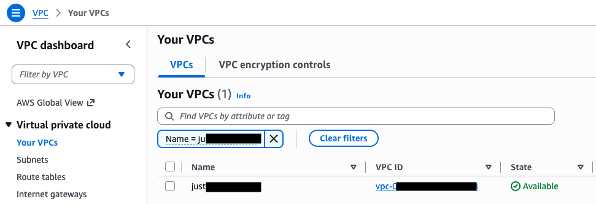
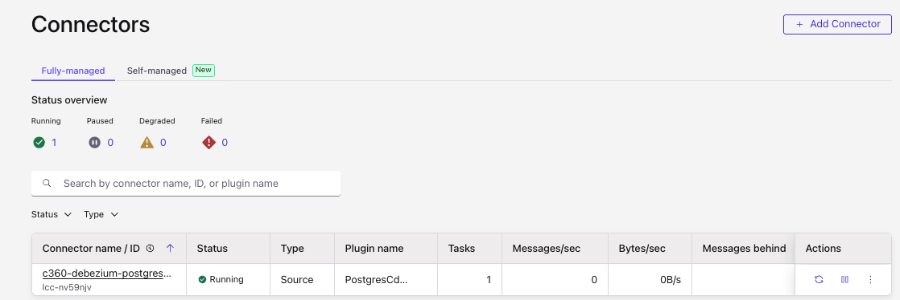
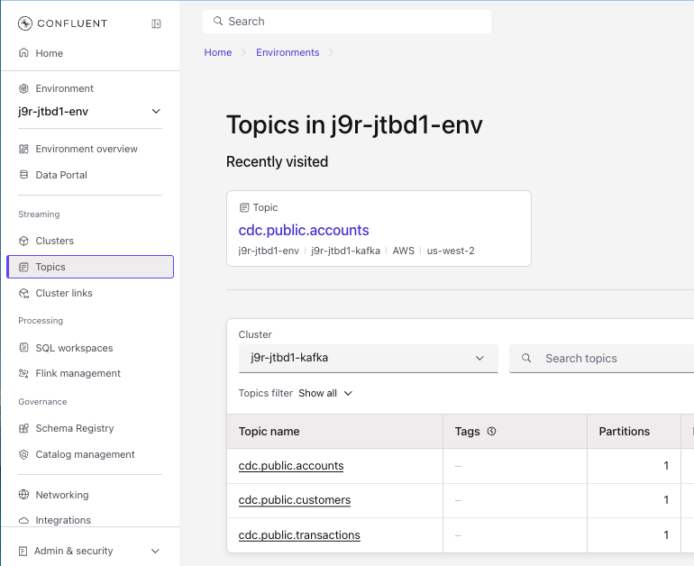
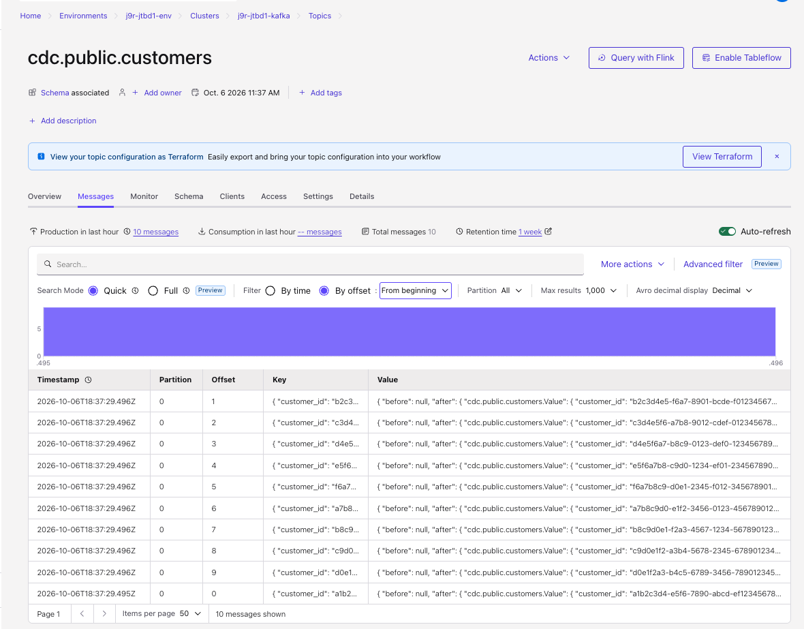

# AWS Resources

This section of the documentation is to create AWS resources for the end-to-end Streamhouse demonstration with source database, S3 buckets and Catalog. 

Terraform is organized under the [`IaC/`](IaC/) directory as **three independent root modules** (separate local state), each file-per-concern. This split lets the core Confluent Cloud stack run locally with **no AWS credentials**; AWS and the managed connector are opt-in cost paths.

- [`IaC/AWS/`](IaC/AWS/) — **AWS stack**: PostgreSQL RDS 17 (CDC-ready), VPC/subnet lookups, security group (allowlists Confluent egress IPs), KMS, and the Secrets Manager secret consumed by `IaC/connector/`. Run with [`scripts/tf_aws.sh`](../scripts/tf_aws.sh) as it needs AWS credentials and `CONFLUENT_CLOUD_API_KEY/SECRET` exported as to setup of the security group reads Confluent egress IPs dynamically.

- [`IaC/connector/`](IaC/connector/) — managed Debezium Postgres CDC connector on Confluent cloud: reads the core stack's outputs from `../ccloud/terraform.tfstate` via `terraform_remote_state`, and the RDS credentials from AWS Secrets Manager. Run with [`scripts/tf_connector.sh`](scripts/tf_connector.sh) (needs AWS creds). Optional — in local mode the backend app writes Debezium-shaped events directly to `cdc.public.*` topics instead.

**Apply order:** `IaC/ccloud` → `IaC/AWS` →  `IaC/connector.


The resources created are illustrated in following figure:


* RDS Postgresql instance
* Security Group and metwork policies for the application load balancer
* Secrets

### Pre-requisites

* Get [Terraform cli](https://developer.hashicorp.com/terraform/tutorials/aws-get-started/install-cli)
* Get [aws CLI](https://docs.aws.amazon.com/cli/latest/userguide/getting-started-install.html)
* Get psql client to query Postgresql instance:
    ```
    brew install libpq
    ```

* Login to AWS console using one of your profile aved in `~/.aws/credentials` 
    ```sh
    aws sso login --profile your-profile-name
    export AWS_PROFILE="your-profile-name"
    ```

    if for any reason you do not have a profile, use: `aws configure`
    
* Find the VPC you want to use to deploy RDS instance. For that go to the AWS Console, VPC and then select one of the VPC_id
    
* Find you the public IP address of your machine: [https://checkip.amazonaws.com](https://checkip.amazonaws.com)
* Under `IaC/aws/` copy to `terraform.tfvars.example` to  `terraform.tfvars` and fill in real values.
    ```sh
    cp terraform.tfvars.example terraform.tfvars
    ```
    Do NOT commit terraform.tfvars to version control. IT is gitignored as of now in this repo.
* Modify terraform environment variables `terraform.tfvars` for cloud region, vpc_id and my_ip_addr
* Be sure to have CONFLUENT_CLOUD_API_KEY and CONFLUENT_CLOUD_API_SECRET exported in the Terminal session


#### AWS Resources: RDS Postgresql

The database is created in a public subnet of an existing VPC but the security group uses the user ip address to define a rule 


#### AWS RDS Postgresql

The terraform under `IaC/AWS` folder creates the RDS Postgresql 17 instance, with DB subnet group within an existing VPC, security group policies to restrict traffic to PostgreSQL on port 5432 within the existing VPC. The Ingress rules allow access to Postgres TCP port 5432 from VPC, client CIDRs, and Confluent Cloud egress IP addresses.

RDS storage is encrypted with KMS Customer Managed Key and DB secrets. Database credentials are securely saved in AWS Secrets Manager.

Run this stack through the [`scripts/tf_aws.sh`](../scripts/tf_aws.sh) wrapper rather than calling `terraform` directly. The wrapper handles two credential gotchas that make a bare `terraform plan` fail:

- **AWS**: SSO profiles often store temporary (`ASIA…`) keys *without* an
  `aws_session_token` in the shared files. The AWS CLI still works from its SSO
  cache, but Terraform's provider rejects the incomplete set (`No valid credential
  sources found`). The wrapper refreshes the SSO token if needed and exports the full
  key + secret + session-token triple into the environment. It also verifies the
  resolved account matches the expected one (`829250931565` by default; override with
  `EXPECTED_AWS_ACCOUNT_ID`) and fails fast if a similarly-named profile lands in the
  wrong account — e.g. `829250931565_nonprod-administrator` actually resolves to
  `898188061957`, so use `AWS_PROFILE=default` (or another profile in the right account).
- **Confluent**: the security group ingress is built from the Confluent Cloud egress
  IPs, so the Confluent provider needs `cloud_api_key` / `cloud_api_secret`. Export
  `CONFLUENT_CLOUD_API_KEY` and `CONFLUENT_CLOUD_API_SECRET` before running the
  wrapper; it defensively strips any incomplete native Schema Registry / Flink env
  vars that would otherwise trip the provider's all-or-none validation.

```sh
# Confluent Cloud API creds must be exported (the wrapper does not read ~/.confluent/.env)
export CONFLUENT_CLOUD_API_KEY=...
export CONFLUENT_CLOUD_API_SECRET=...

# Uses the `default` AWS profile unless AWS_PROFILE is set
scripts/tf_aws.sh plan
scripts/tf_aws.sh apply
scripts/tf_aws.sh output
```

The output gives us the following:

```
db_security_group_id = "sg-...."
db_subnet_group_name = "c360-j9r-db-subnet-group"
rds_address = ".....rds.amazonaws.com"
rds_database_name = "c360db"
rds_endpoint = "....rds.amazonaws.com:5432"
rds_port = 5432
secrets_manager_secret_arn = "arn:aws:secretsmanager:....."
vpc_cidr_block = "10......"
vpc_id = "vpc-...."
```

Once the database is up and running, the backend creates the tables, the `c360_cdc_publication`, and seeds the committed CSV dataset on startup — there is no separate schema/seed script. Build `DATABASE_URL` from the RDS secret and run the backend bootstrap (or just start the API with `SINK=postgres`):

```sh
# Pull the RDS credentials emitted into Secrets Manager by Terraform
export RDSHOST="c360-....rds.amazonaws.com"
export DB_PASSWORD=$(aws secretsmanager get-secret-value \
  --secret-id arn:aws:secretsmanager:us-west-2:...:secret:c360-... \
  --query SecretString --output text | jq -r .password)

cd apps/backend
DATABASE_URL="postgresql://dbadmin:${DB_PASSWORD}@${RDSHOST}:5432/c360db?sslmode=require" \
SINK=postgres uv run python bootstrap.py
```

The bootstrap is idempotent, so it is safe to re-run. The CDC publication now covers all three tables (`customers`, `accounts`, `transactions`).

#### Use psql to verify data in RDS

* First get the DB password from the AWS secrets

```sh
export RDSHOST="c360-j9r-postgres.c.....rds.amazonaws.com"
DB_PASSWORD=$(aws secretsmanager get-secret-value --secret-id arn:aws:secretsmanager:us-west-2:.....:secret:c360-j9r-.... --query SecretString --output text |jq -r .password)
```

* Use this to connect via psql
```sh
PGPASSWORD=$DB_PASSWORD psql -h $RDSHOST -d c360db -U dbadmin

```

* In psql session
```sql
--- see all the tables in your current database
\dt
SELECT * FROM public.accounts
```

#### Some info

* AWS RDS requires a DB Subnet Group. RDS manages its own Elastic Network Interfaces (ENIs). An RDS instance requires a DB Subnet Group defining a pool of subnets across at least two different Availability Zones (AZs) in that VPC (even for Single-AZ instances, so AWS can perform maintenance, failover, or migrations).
* The aws_db_instance resource only accepts db_subnet_group_name, not individual subnet IDs


### Notes

It is important to get the following information to be able to create the Kafka Connector for change data capture.

| Resources | |
|-----| ---- |
| Region | us-west-2 |
| RDS host name | e.g. c360-j9r-postgres.c.....us-west-2.rds.amazonaws.com |
| secrets_manager_secret_arn | Resource ref for AWS Secrets Manager |
| Database password  | Coud be created by the admin or retrieve from the secret |
| Public certificates | a .pem file to download |


*To retrieve password from secret, knowing the secret arn do:*
```sh
aws secretsmanager get-secret-value --secret-id arn:aws:secretsmanager:us-west-2:.....:secret:c360-j9r-rds-credentials-9x --query SecretString --output text |jq -r .password
```

It is possible to retrieve the secret ARN from secrets manager:


#### Enhancement

* RDS should be in private subnet with VPC private link set to Confluent Cloud

## Deploying the CDC Kafka connector

* Execute the following commands in sequence:

```
./scripts/tf_connector.sh init

./scripts/tf_connector.sh plan

./scripts/tf_connector.sh apply
```

* Go to the console to verify Connector is created and running
  

* And verify topics are created
  

* And have some records
  
