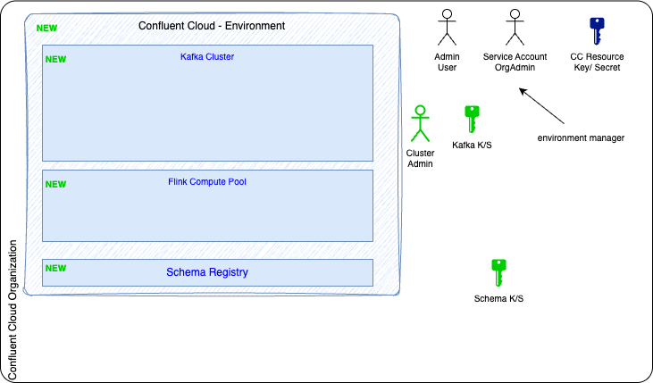
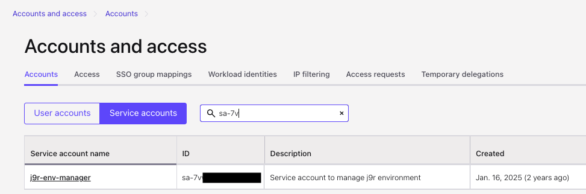
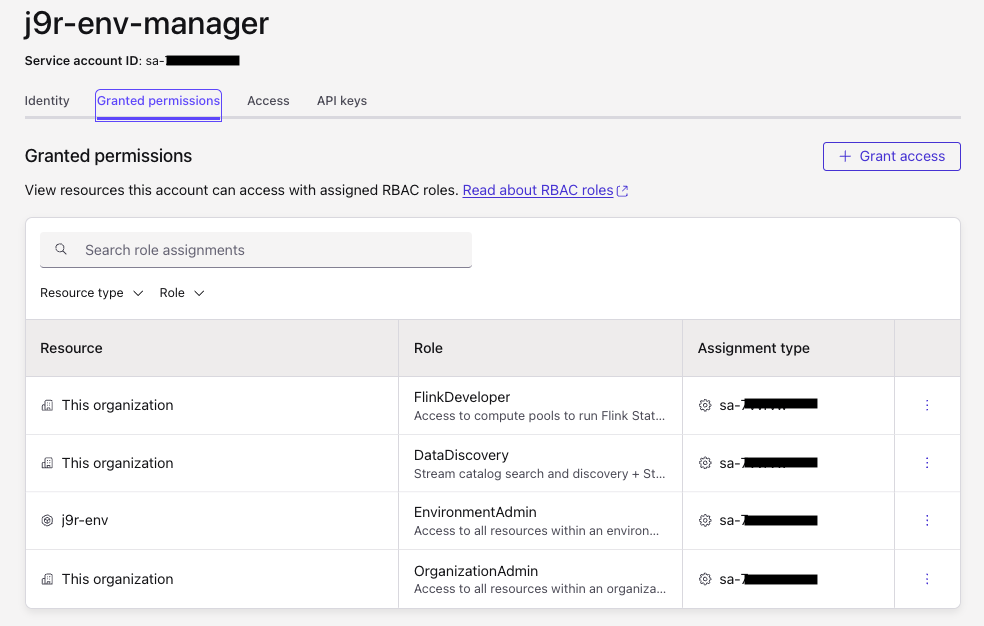
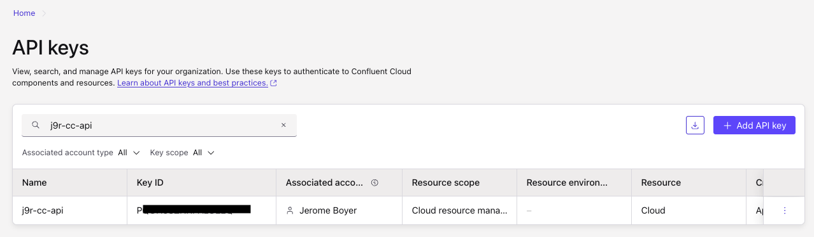
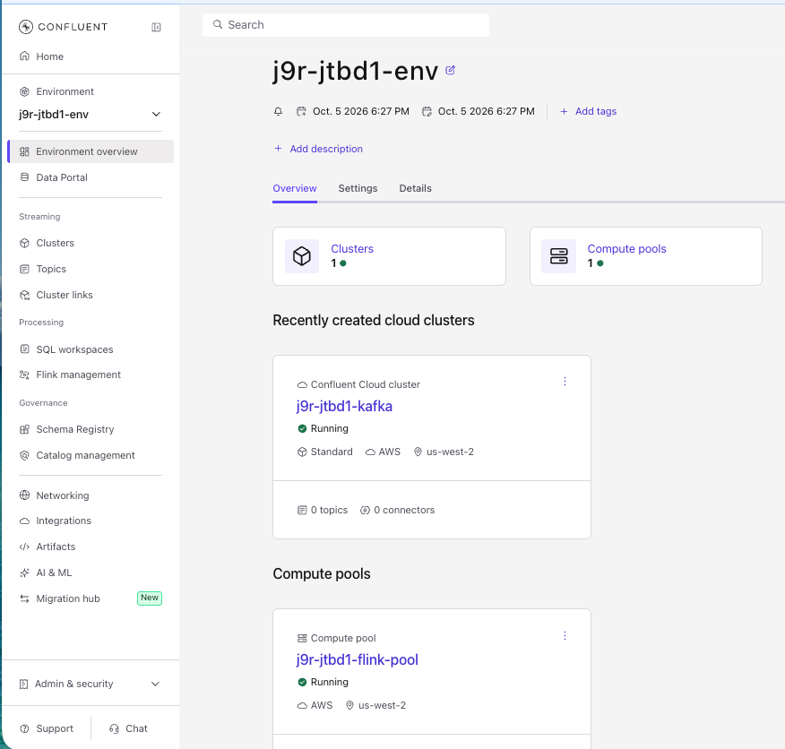

# Defining Confluent Cloud Resources with the Terraform

This section of the documentation is to present the exhaustive steps to deploy the Confluent Cloud components for Streamhouse.

Terraform is organized under the [`IaC/`](IaC/) directory as **three independent root modules** (separate local state), each file-per-concern. This split lets the core Confluent Cloud stack run locally with **no AWS credentials**; AWS and the managed connector are opt-in cost paths.

The figure below illustrates what the terraforms in [`IaC/ccloud/`](IaC/ccloud/) will deploy. We start from an existing Organization, with a user with Org Admin role, and Confluent Cloud Resource API Key and Secret. 



* Create environment, Kafka cluster, 
* Flink compute pool, Schema Registry, service account + Kafka/SR API keys. 


### Folder Structure

IaC/ccloud/ — core Confluent Cloud stack:

- provider.tf: dropped the aws provider and the unused random provider — now requires only confluent (verified via terraform providers).
- data.tf: removed the AWS Secrets Manager read + local.rds_*; kept env_mgr.
- flink.tf: added confluent_flink_compute_pool.pool (the file was empty).
- connector.tf: deleted (moved out).
- variables.tf: dropped rds_secret_arn/connector_name/kafka_topic_prefix; added flink_max_cfu.
- outputs.tf: replaced the connector outputs with flink_compute_pool_id.
- terraform.tfvars/.example: removed the AWS/connector entries.

### Pre-requisites

* Get the [git cli](https://git-scm.com/install/)
* Clone this repository
    ```sh
    git clone https://github.com/jbcodeforce/stream_house_c360_demo.git
    cd stream_house_c360_demo.git
    ```
* Get [Terraform cli](https://developer.hashicorp.com/terraform/tutorials/aws-get-started/install-cli)

### Get Confluent Cloud environment information
* Log to the Confluent Console
* Get your user identifier if you are an organization admin, or ask your Organization administrator for a service account that has organization admin role. User has an id starting with `u-`, while service account has: `sa-`. We recommend using a service account
    

    Verify the role binding for this service account to have the Org Admin
    
* Get the API KEY or create new one for Cloud resource management:
    
* Export those key and secret as environment variables:
    ```sh
    export CONFLUENT_CLOUD_API_KEY=PQ...
    export CONFLUENT_CLOUD_API_SECRET=cflt....
    ```
* Under `IaC/ccloud/` copy to `terraform.tfvars.example` to  `terraform.tfvars` and fill in real values.
    ```sh
    cp terraform.tfvars.example terraform.tfvars
    ```
    Do NOT commit terraform.tfvars to version control. IT is gitignored as of now in this repo.
* Modify the settings for cloud provider, region, prefix and service account id 

### Perform the deployment

* Initialize terraform state under IaC/ccloud folder:
    ```sh
    terraform init
    ```
     
* Run the plan to assess what will be created
    ```sh
    terraform plan
    ```

* Deploy the resources
    ```sh
    terraform apply
    ```

    Some resource may take some time to create.

* The result print the output content, which can always bveing retrieve using:
    ```sh
    terraform output
    ```

* Validate in the Confluent Console that the resources are created
    

* Get API Keys and Secrets in env variables
    ```sh
    ./scripts/set_env_from_tf.sh
    ```